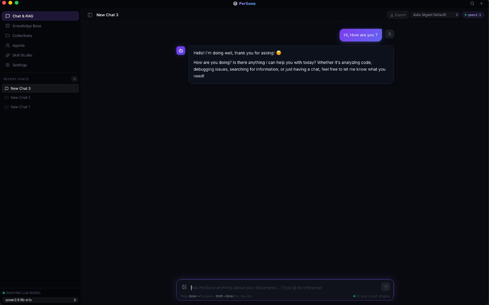
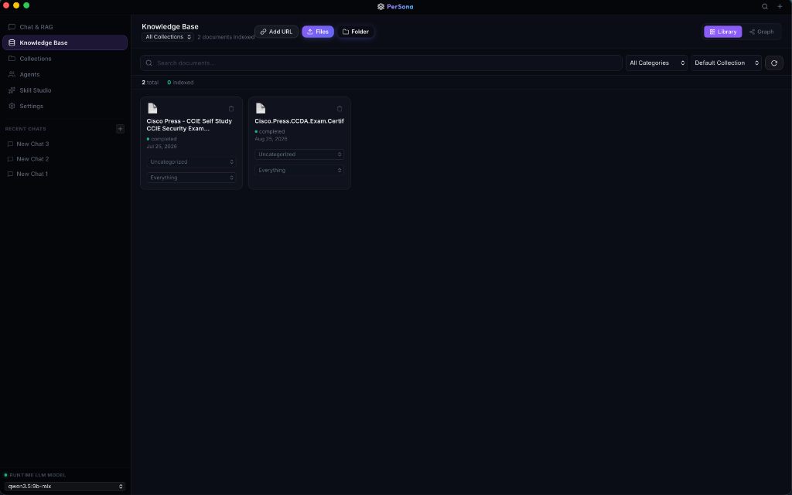
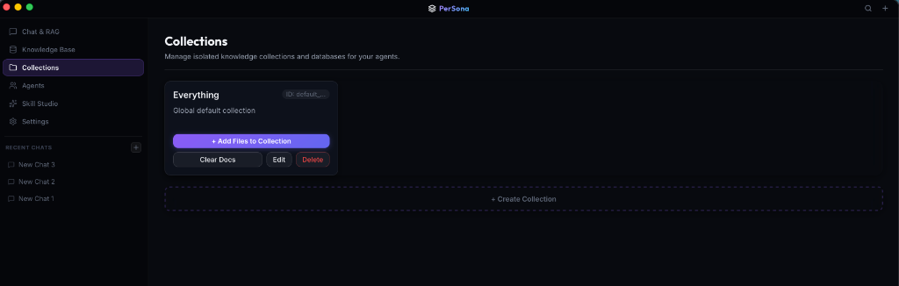
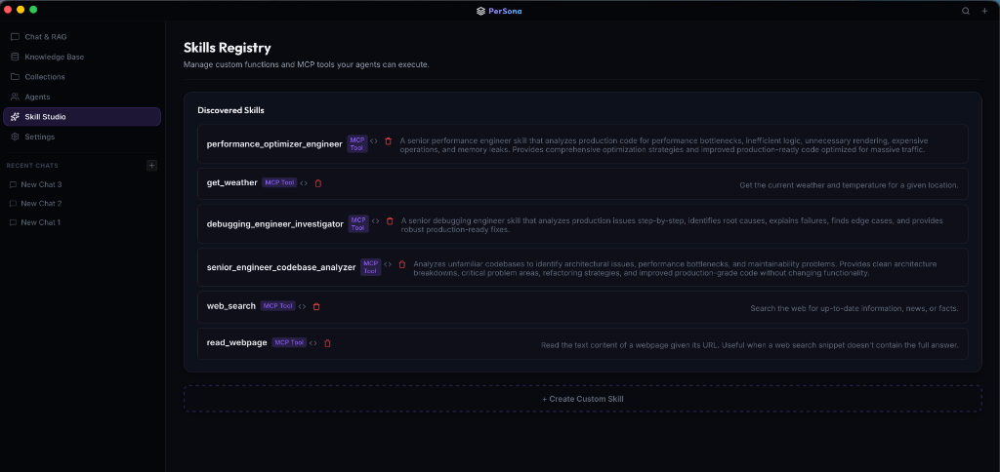
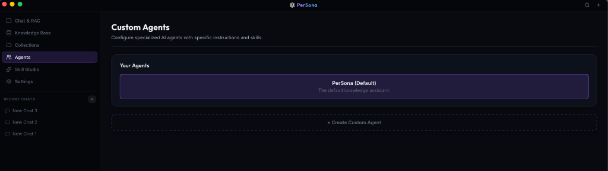

# PerSona — Your Private AI Knowledge Assistant

> Ask questions about your own documents. Offline. No cloud. No subscriptions.

PerSona is a **local-first AI assistant** that turns your files into a searchable, conversational knowledge base — powered entirely by models running on your own machine via [Ollama](https://ollama.com).

---

## What It Does

You drop in your documents. PerSona reads them, understands them, and lets you have a natural conversation about them — no data ever leaves your device.

- 📄 **Ingest anything** — PDF, DOCX, TXT, Markdown, HTML, Excel, JSON, OpenAPI specs, Postman collections, and web URLs
- 🧠 **Ask in plain English** — RAG-powered retrieval finds the right context before answering
- 🤖 **Auto-creates tools** — the model learns from your documents and writes reusable skill scripts as it works
- 🔄 **Syncs live** — watch a folder and it ingests changes automatically in the background
- 🌐 **Runs as a server** — expose a REST API so other devices on your network can connect
- 🔒 **Fully offline** — every model, vector, and document stays on your machine

---

## Screenshots & Features

<div align="center">

### 💬 Chat & Offline RAG
Conversational search with direct citations, document previews, and streaming reasoning.


<br/><br/>

### 📚 Knowledge Base
Manage document indexing, categories, collections, and vector search.


<br/><br/>

### 📁 Isolated Collections
Group and isolate documents into specific vector workspaces.


<br/><br/>

### ⚡ Skill Studio (MCP Tool Registry)
Dynamic tool synthesis and secure MCP script execution.


<br/><br/>

### 👥 Custom Agents
Specialized AI personas with customized instructions and assigned skill sets.


</div>


## How It Works

```
Your Files → Parser → Chunker → Embeddings (Ollama) → LanceDB Vector Store
                                                              ↓
                     User Question → RAG Retrieval → Agent Executor → Local LLM → Answer
```

The **Agent Executor** loop gives the model access to tools (skills). If a skill doesn't exist yet, it writes one automatically via `synthesize_skill` and registers it for future use.

---

## Quick Start

### Prerequisites

| Requirement | Version |
|---|---|
| [Rust](https://rustup.rs) | 1.80+ |
| [Node.js](https://nodejs.org) | 18+ |
| [Ollama](https://ollama.com) | Latest |

### 1. Pull a local model

```bash
ollama pull llama3.2        # Recommended (CPU-friendly, 3B params)
ollama pull llama3.1        # Optional (GPU-accelerated, 8B params)
```

### 2. Clone and install

```bash
git clone https://github.com/MayankGit-hu/PerSona.git
cd PerSona
npm install
```

### 3. Run in development mode

```bash
npm run tauri dev
```

The desktop app opens automatically. Ollama must be running (`ollama serve`) before launching.

---

## Usage

1. **Add documents** — click the Knowledge Base tab and drag in files, paste a URL, or point to a local folder to auto-sync
2. **Start a conversation** — open a new chat and ask anything about your documents
3. **Watch skills grow** — as you ask questions, the model registers reusable tools in the Skill Library automatically
4. **Switch models** — use the Runtime Provider Model selector in the sidebar; all available Ollama models appear automatically
5. **Share with other devices** — enable the Host Server toggle in Network Settings to expose the REST API on your local network

---

## Building for Production

```bash
npm run tauri build
```

The signed `.app` bundle is output to `src-tauri/target/release/bundle/`.

---

## Tech Stack

| Layer | Technology |
|---|---|
| Desktop Shell | Tauri v2 (Rust + WebView) |
| Frontend | React + TypeScript + Vite |
| LLM Runtime | Ollama (local) |
| Vector Store | LanceDB (embedded) |
| Metadata DB | SQLite |
| HTTP Server | Axum |
| Parsers | lopdf, calamine, html2text, quick-xml |

---

## License

MIT
